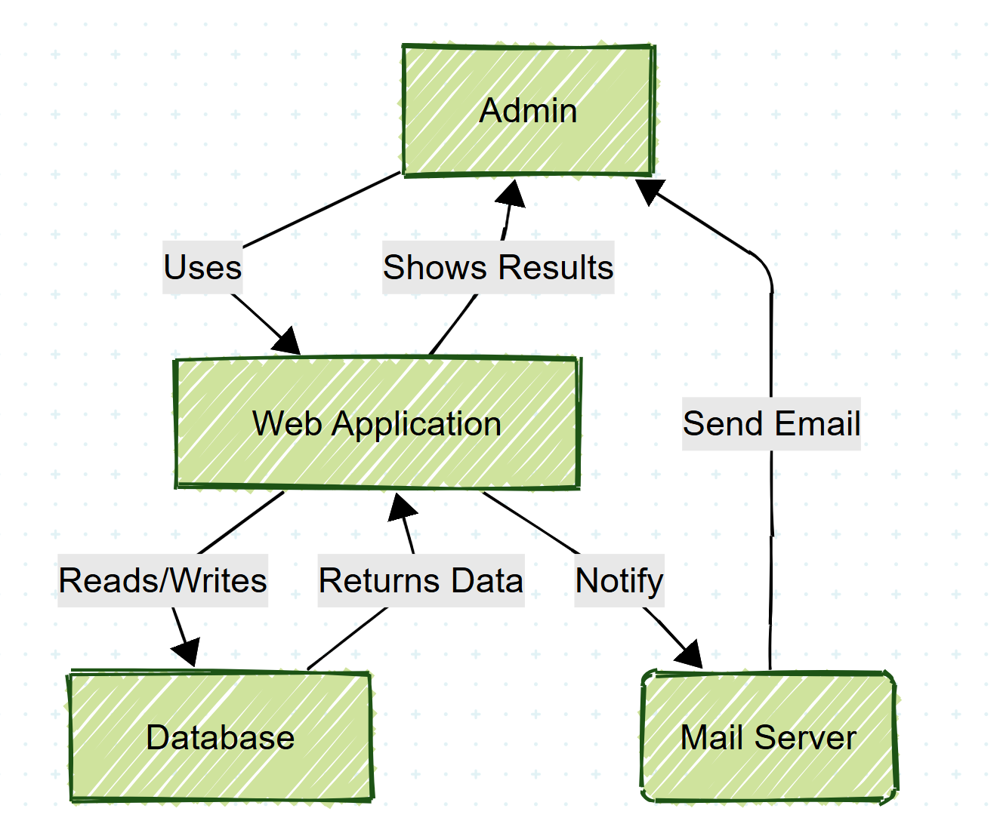

## Architecture

This is a Java EE web application running on Open Liberty with a hybrid architecture that supports both traditional servlets and Spring MVC. The application manages student profiles with CRUD operations.



### System Architecture

```
┌─────────────────────────────────────────────────────────────────┐
│                        Web Tier (Presentation)                  │
├─────────────────────────────────────────────────────────────────┤
│  Browser Client                                                 │
│  ├── HTTP/HTTPS Requests                                        │
│  └── REST API Calls                                             │
└─────────────────┬───────────────────────────────────────────────┘
                  │
┌─────────────────▼───────────────────────────────────────────────┐
│                    Open Liberty Server                          │
│                   (Java EE Container)                           │
├─────────────────────────────────────────────────────────────────┤
│  Web Container (Servlet 4.0, JSP 2.3)                           │
│  ├── Traditional Servlets                                       │
│  │   ├── IndexServlet (/)                                       │
│  │   ├── AddStudentServlet (/addStudent)                        │
│  │   └── StudentProfileListServlet (/studentProfileList)        │
│  │                                                              │
│  ├── Spring MVC Framework                                       │
│  │   ├── DispatcherServlet (/app/*)                             │
│  │   ├── StudentController                                      │
│  │   └── AddStudentController                                   │
│  │                                                              │
│  └── JSP Views                                                  │
│      ├── index.jsp                                              │
│      ├── spring-index.jsp                                       │
│      └── add_student_profile.jsp                                │
└─────────────────┬───────────────────────────────────────────────┘
                  │
┌─────────────────▼───────────────────────────────────────────────┐
│                   Business Logic Tier                           │
├─────────────────────────────────────────────────────────────────┤
│  Spring Services                                                │
│  ├── StudentService (@Service)                                  │
│  │   ├── getAllStudents()                                       │
│  │   └── saveStudent()                                          │
│  │                                                              │
│  └── Domain Models                                              │
│      └── StudentProfile (Entity)                                │
└─────────────────┬───────────────────────────────────────────────┘
                  │
┌─────────────────▼───────────────────────────────────────────────┐
│                  Data Access Tier                               │
├─────────────────────────────────────────────────────────────────┤
│  iBATIS/MyBatis Integration                                     │
│  ├── MyBatisUtil (SqlMapClient Factory)                         │
│  ├── sql-map-config.xml (Configuration)                         │
│  └── Student_SqlMap.xml (SQL Mappings)                          │
│  │                                                              │
│  └── JNDI DataSource (jdbc/StudentDB)                           │
└─────────────────┬───────────────────────────────────────────────┘
                  │
┌─────────────────▼───────────────────────────────────────────────┐
│                    Database Tier                                │
├─────────────────────────────────────────────────────────────────┤
│  MySQL Database                                                 │
│  ├── studentdb Database                                         │
│  ├── Connection Pool                                            │
│  └── Student Tables                                             │
└─────────────────────────────────────────────────────────────────┘
```


### Technology Stack

**Application Server:**
- Open Liberty (Java EE 8 Web Profile)
- Features: servlet-4.0, jsp-2.3, jdbc-4.3, jndi-1.0, javaMail-1.6

**Web Framework:**
- Dual approach: Traditional Servlets + Spring MVC 5.3.39
- JSP for view rendering
- JSON responses via Jackson

**Data Access:**
- iBATIS/MyBatis for ORM
- JNDI DataSource with connection pooling
- MySQL Connector/J 8.0.33

**Database:**
- MySQL 8.0
- Database: `studentdb`
- Connection pooling (2-10 connections)

**Build & Deployment:**
- Apache Ant for build automation
- Docker containerization
- Docker Compose for multi-service deployment

### Application Components

#### Web Layer
1. **Traditional Servlets** - Handle direct HTTP requests
   - `IndexServlet`: Root path handler with student data
   - `AddStudentServlet`: Student creation endpoint
   - `StudentProfileListServlet`: Student listing with JSON output

2. **Spring MVC Controllers** - Modern web layer
   - `StudentController`: RESTful student operations
   - `AddStudentController`: Form-based student creation

#### Service Layer
- `StudentService`: Business logic for student operations
- Dependency injection via Spring IoC container
- Transaction management (implicit via iBATIS)

#### Data Layer
- `MyBatisUtil`: SqlMapClient factory and session management
- SQL mappings in XML files for database operations
- JNDI-managed DataSource for connection pooling

#### Configuration
- `web.xml`: Servlet and Spring configuration
- `server.xml`: Open Liberty server configuration
- `sql-map-config.xml`: iBATIS/MyBatis configuration
- Spring context files for dependency injection

### Key Features
- **Hybrid Architecture**: Supports both traditional servlets and Spring MVC
- **JSON API**: REST endpoints with Jackson serialization
- **Connection Pooling**: Efficient database connection management
- **Containerized Deployment**: Docker and Docker Compose support
- **Security**: Transport security and application security features
- **Mail Integration**: JavaMail support for email functionality

### Data Flow
1. Client sends HTTP request to Open Liberty
2. Request routed to appropriate servlet or Spring controller
3. Controller/Servlet calls service layer for business logic
4. Service layer uses MyBatis to execute database operations
5. Results formatted as HTML (JSP) or JSON response
6. Response sent back to client
